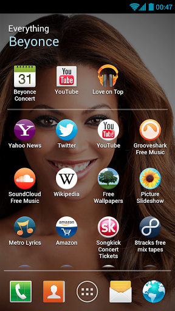
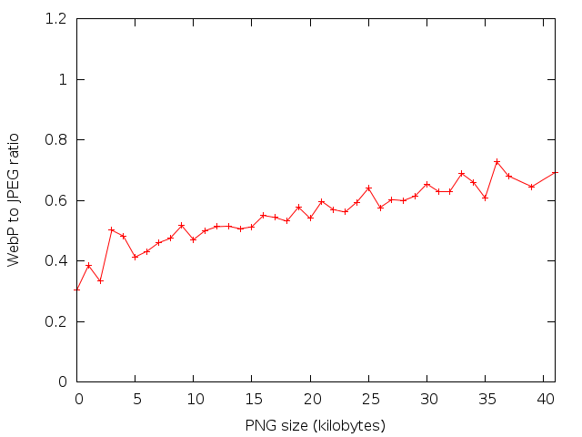

# Testing WebP compression for app icons

## Introduction

[Everything.me](http://corp.everything.me/) results are shown to the
user as a grid of application icons that are sent from the server in
response to a query submitted by the user.

Here is an example of search results from Everything.Me:

Recently, the graphic design for a new feature called for some of
those icons to be displayed with full alpha channel. Our initial
design used PNG images, but it increased the response size to an
unreasonable number of bytes, since PNG uses a lossless compression,
resulting in much bigger files than a lossy compression would. 

We researched the option of using the WebP image format, [introduced in 2010
by Google](http://blog.chromium.org/2010/09/webp-new-image-format-for-
web.html).

The WebP format aims to provide both transparency and a lossy compression, at
a much smaller file sizes than JPEG and PNG both, and is [already supported in
recent versions of Android, Chrome and Opera
browsers](https://en.wikipedia.org/wiki/WebP#Support).

## Corpora

A collection of 1000 icons for Android apps were used.

The icons were downloaded as PNG files from the [Google Play's Android app
store website](https://play.google.com/store), and represent an example of app
icons we expect to find in real world use.

Those icons have a size of 124x124 pixels, and use full RGBA color.

## Method

Following [1] and [3], we used the [DSSIM](https://en.wikipedia.org/wiki/Structural_similarity) index to estimate the quality of the compressed image, as it is considered to better model quality than a SNR rating would.

  * To compute the DSSIM index, we used a publicly available implementation (<https://github.com/pornel/dssim/>) that computes the DSSIM index of two PNG files.
  * The pictures were first compressed from the source PNG to WebP format using the cwebp utility with the default options, that is, compression factor of 75 for RGB channels (-q), and compression factor of 100 for the alpha channel (-alpha_q).  
Version 0.3.0 of the cwebp utility (part of the
[libwebp](https://developers.google.com/speed/webp/download) library was
used).
  * To compute the DSSIM index, the picture were then converted back to PNG using the dwepb utility from the same library, and the DSSIM index recorded.
  * To evaluate WebP over JPEG compression, the same pictures were also compressed to JPEG, trying to maintain similar quality to the previously compressed JPEG images:
  * As the JPEG format does not support transparency, first the alpha channel was removed using version 6.7.7-10 of the ImageMagick software (as [provided in Ubuntu 12.10](https://launchpad.net/ubuntu/+source/imagemagick/8:6.7.7.10-2ubuntu4)).
  * The image was converted to JPEG using the cjpeg utility packaged with build 20120920 of the [libjpeg-turbo](http://libjpeg-turbo.virtualgl.org/) library (as [provided in Ubuntu 12.10](https://launchpad.net/ubuntu/quantal/amd64/libjpeg-turbo-progs)).
  * As cjpeg can not read PNG files, the PNG file was first converted to PNM using ImageMagick.
  * To compare the resulting image to the flatten PNG, it was converted back to PNM and then to PNG using djpeg and convert.
  * The DSSIM index of the resulting PNG with the original image with alpha channel removed was calculated.
  * The process above was iterated until an JPEG image with a DSSIM similar to the WebP image was found (we allowed the JPEG DSSIM to be higher than the WebP one, which favours the JPEG size). This allowed us to compare the size of similar images.
  * The script used for the above process is (https://github.com/EverythingMe/webp-test/blob/master/webp-test.rb)[available on Github].

## Results

The following chart shows the compression ratio for the WebP files versus the
compression ratio of a JPEG files created from the same PNG source:

The average reduction in size and average DSSIM index of the resulting images
is as follows:

<table>
<tdata>
  <tr>
    <td></td>
    <td>Average ratio to original PNG size</td>
    <td>Average DSSIM</td>
  </tr>
  <tr>
    <td>WebP</td>
    <td>20.4%</td>
    <td>0.09126</td>
  </tr>
  <tr>
    <td>JPEG</td>
    <td>40.4% (with alpha channel removed)</td>
    <td>0.09961 (compared to source without alpha channel)</td>
  </tr>
</tdata>
</table>

The average JPEG quality index used to achieve that compression was 89.5
(compared to the compression factor of 75 for the WebP files).

Looking at the ratio of WebP file sizes to PNG file sizes ratio, we can see
WebP constantly provides better results:

The (https://github.com/EverythingMe/webp-test/blob/master/results.dat)[full data set] is provided.

## Conclusion

We found that when WebP allows for icons with a quality of a JPEG file that
would take double the size, while retaining the alpha channel that would be
lost when using JPEG (we assume bundling the alpha channel with the JPEG would
increase the JPEG size).

Because of that result, the next release of our next Android client will use
the WebP format for getting icons.

## References

  1. [WebP Compression Study, Google Inc. Draft 0.1 as of May 18, 2011](https://developers.google.com/speed/webp/docs/webp_study)
  2. [Jyrki Alakuijala, Ph.D., Google Inc., Lossless and Transparency Encoding in WebP. 2012 Aug. 16.](https://developers.google.com/speed/webp/docs/webp_lossless_alpha_study)
  3. [Zhou Wang; Bovik, A.C.; Sheikh, H.R.; Simoncelli, E.P., "Image quality assessment: from error visibility to structural similarity," Image Processing, IEEE Transactions on , vol.13, no.4, pp.600,612, April 2004](http://www.cns.nyu.edu/%7Ezwang/files/papers/ssim.html)
